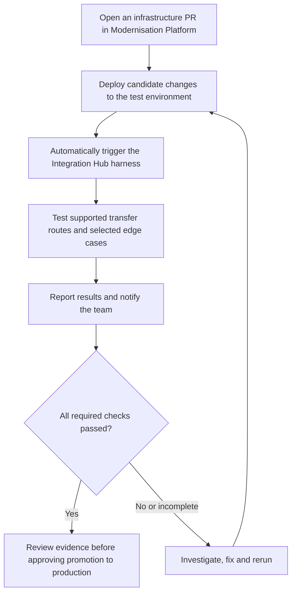
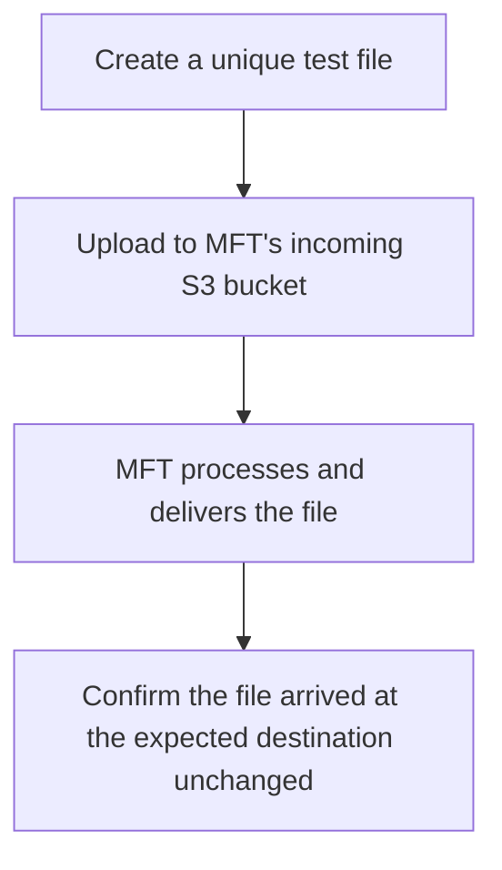

## Planned Flow: Testing Infrastructure Changes

Automatically check that infrastructure changes haven’t broken the file-transfer service before those changes reach production.

## Current Flow

Verify that a file uploaded to MFT reaches the expected destination unchanged.

See the [running instructions](../../README.md#file-transfer-smoke-test) for details.